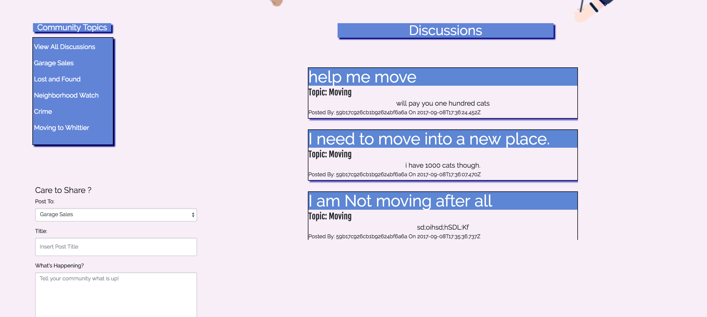
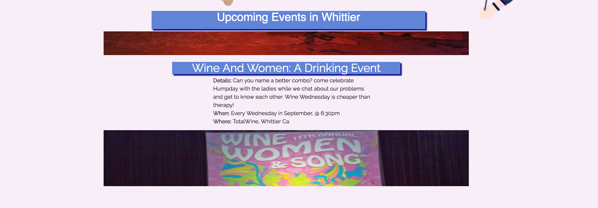

<h4 align="center">
  
</h4>

<b>Welcome To Community!</b> 
 
A simple, user friendly website for all things going on in your neighborhood! Find local events, recomendations for food and drinks, party ideas and more! Community makes it easy to stay up to date with your surroundings and the people surrounding you. 

---
---
<h4> a brief overview </h4>

---
<h3 align="center"> 
    
</h3>

 <h4>this next portion walks you through the simple ui of the Community Website.</h4>

<b>

[CLICK ME TO VIEW TRELLO](https://trello.com/b/9FuY59fd/community)

[CLICK ME TO VIEW COMMUNITY  WEBSITE](https://radiant-brook-29903.herokuapp.com/)

</b>

- Main Page:
    - Main Page will show a simple UI, a scrolling view of discussions, that can be sorted via categories on the left hand side. There is also a map of the city down below.
     
<h5 align="center"> 
    
</h5>

- Events Page.
    - Here you will find a scrolling list of all the events in your city. Events are updated weekly!

<h5 align="center"> 
    
</h5>

- Profile Page:
    - Profile Page is still a work in progress, but will display your discussions, and user information. which you will be able to edit.. eventually.

<h5 align="center"> 
    
</h5>

 
---
---

<h4> Let's Continue... </h4>

---

<h4 align="center">
      
     </h4>

 <h4>Listed below are the technoliges Used to create this app: </h4>

1) - JSX
   - CSS 
   - BootStrap 
   - JAVASCRIPT 
   - Google Maps API
   - Heroku
   - MERN Stack

    
3) Mac OS: Pages:
    - Used Pages to edit images/ resizing. 

---
---

<h4> Lastly... </h4>

---

<h5 align="center">
      </h5>

Coming soon! some cool new features:

- Adding ability to edit and delete discussions
- Profile Page to see your discussions and profile information.
- Up to date traffic via Google Maps API
- Twitter feeds linking to city updates!
- & Way more!
---
---

<h5 align="center">
      
     </h5>

  Thank you for reading and visiting Community. i hope you enjoy the app! 
